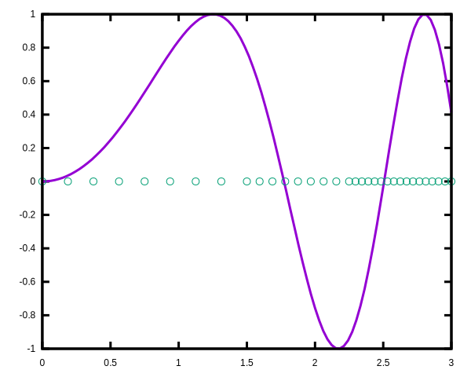

# Introduction

Adaptive Simpson's numerical integration method.

# Install

Needs GNU MARST and GNU Fortran.

    make
    (cd example; make)

# Example

    ! ./mckeeman | awk 'sub(/x = /, "")' > /tmp/q
    ! ./kuncir | awk 'sub(/x = /, "")' > /tmp/q
    plot sin(x*x), "/tmp/q" u 1:(0) w points ps 1 pt 7

# References

- https://www.gnu.org/software/marst
- https://gcc.gnu.org/fortran
- Kuncir, G. F. (1962). Algorithm 103: Simpson's rule
  integrator. Communications of the ACM, 5(6), 347.
- McKeeman, W. M. (1962). Algorithm 145: Adaptive numerical
  integration by Simpson's rule. Communications of the ACM, 5(12),
  604.
- Lyness, J. N. (1970). Algorithm 379: Squank (Simpson Quadrature used
  adaptivity—noise killed)[D1]. Communications of the ACM, 13(4),
  260-262
